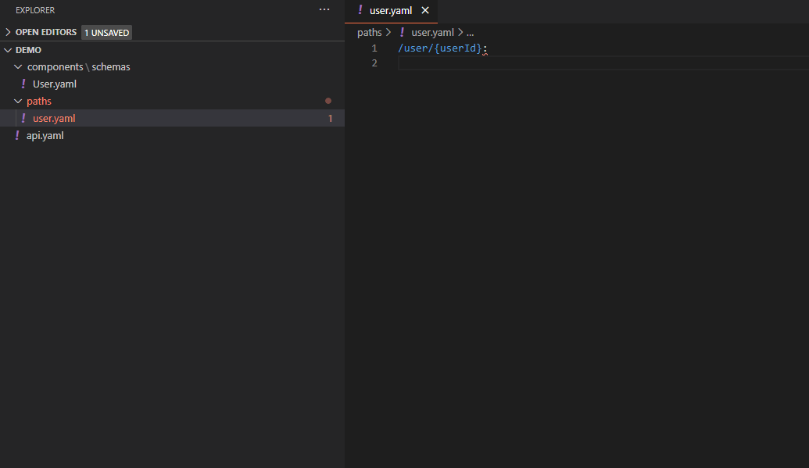

# OpenApi Snippets

## Usage



### snippets

currently supported snippets:

|            Prefix | Content                                    |
| ----------------: | ------------------------------------------ |
|         `pathget` | GET path object                            |
|    `pathgetparam` | GET path object with request parameters    |
|        `pathpost` | POST path object                           |
|         `pathput` | PUT path object                            |
|    `pathputparam` | PUT path object with request parameters    |
|      `pathdelete` | DELETE path object                         |
| `pathdeleteparam` | DELETE path object with request parameters |
|    `schemaObject` | Schema object                              |
|  `propertyObject` | Property object for properties of a schema |
|     `contentType` | Several content types                      |

### Validation

JSON and YAML/YML files are being validated according to their respective usage (e.g. Schema Objects). For schema specifications, see [OpenApi Specification v3](https://raw.githubusercontent.com/OAI/OpenAPI-Specification/master/schemas/v3.0/schema.json)

**Note**: For IntelliSense to validate the files, filenames have to match their respective schema:

|          File name pattern | Example           |
| -------------------------: | ----------------- |
| `*-schema.(json,yaml,yml)` | users-schema.json |
|   `*-path.(json,yaml,yml)` | users-path.json   |

You can navigate through predefined anchor points with TAB key. This only works right after inserting a snippet.

**Note**: For YAML/YML files to be supported, the [YAML Extension](https://marketplace.visualstudio.com/items?itemName=redhat.vscode-yaml) has to be installed!

### Keybindings

You can configure custom keybindings for the snippets. For this, open the keybindings.json file of VS Code (Shortcut `Ctrl+K Ctrl+S`, then click on the `Open Keyboard Shortcuts (JSON)` button in the upper right corner).
For any keybinding, use this template and edit the fields which are marked by `<<>>`:

for json files:

```json
{
  "key": "<<Your desired shortcut>>",
  "command": "editor.action.insertSnippet",
  "when": "editorTextFocus",
  "args": {
    "langId": "json",
    "name": "<<Snippet prefix>>"
  }
}
```

for yaml files:

```json
{
  "key": "<<Your desired shortcut>>",
  "command": "editor.action.insertSnippet",
  "when": "editorTextFocus",
  "args": {
    "langId": "yaml",
    "name": "<<Snippet prefix>>"
  }
}
```

For `name` you can use any [snippet prefix](#snippets).

## Installation

Just download and install it from [VS Marketplace](https://marketplace.visualstudio.com/items?itemName=proohit.openapi-snippets). There are no more settings, so the extension is ready to use after installation. It fully works with and extends [OpenAPI (Swagger) Editor](https://marketplace.visualstudio.com/items?itemName=42Crunch.vscode-openapi)
